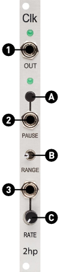

# CLKr

__CLKr__ is an alternate firmware for the 2hp [Clk](https://www.twohp.com/modules/clk) module based on the core of [Mutable Instruments' Grids](https://mutable-instruments.net/modules/grids/). __CLKr__ offers new, specialized functionality and an expanded featureset compared to the stock firmware shipped with __Clk__, while also offering a Legacy Mode that emulates the original functionality.

The inspiration for this alternate firmware came from my frustration using __Clk__ to easily control other modules which expected high-precision clock signals of 24ppqn, such as Pamela's New Workout.

### Same Core Functionality
 - A stable, proven internal clocking system based on Grids'
 - A base BPM range of 20 to 256 (or even higher with control voltage)
 - Analog CV control over the full BPM range.
 - Pause button and gate input to halt the clock in its tracks (...or really just disable the output)

### ...But with  New Features!
 - Range switch now toggles between single-step output and adjustable multipliers
 - Tap Tempo mode offers an alterate way to set your desired clock rate
 - Settings menu lets you set the high-speed resolution and toggle the button  between Pause and Tap Tempo functions
 - OUT keeps blinking even when paused, letting you see how your CV is affecting the rate even without output (even in Legacy mode!)
 - Select between 4ppqn, 8ppqn, and 24ppqn resolution for the high-rate output
 - Tap Tempo and Settings are saved to memory, letting you pick up your patch right where you left off.
 - Legacy mode can switch between linear and logarithmic scaling of the pot and input CV for increased control over high-rate clocks

# Guide
## Front Panel

### Controls
#### A. Multifunction Button
In Pause mode, pressing will pause the output of the clock, and the bottom LED will be illuminated.  
In Tap Tempo mode, pressing twice will set the clock to the beat of those taps, indicated by both LEDs blinking in synchrony. Tapping the button once more or turning the Rate control will unlock the clock.

#### B. Range Switch
Flipping this switch will swap between a low-rate output useful for driving step sequencers and a high-resolution mode perfect for controlling other clock systems.

#### C. Clock Rate 
20 to 240 BPM in Standard Mode.  
10s to 3.4ms in Legacy Mode (depending on the range switch)

### Inputs and Outputs
#### 1. Clock Output
Frequencies ranging between 0.1 and 190 Hz.

#### 2. Pause Input
Stops outputting the clock above 2.5v, starts it below 2.5v.  
NOTE: This overrides the Pause Button, both pausing and unpausing.

#### 3. Tempo CV Input
Internally added (summed) to the value of the Rate control in software.

### Settings
To enter the Settings edit mode, hold down the multifunction button __(A)__ until the LEDs blink in an alternating pattern, and then release.

While in the Settings edit mode, both LEDs will "breathe" when waiting for an input.

To exit the Settings edit mode, hold the multifunction button down again.

#### Changing the function of the multifuction button (A)
While in the Settings mode, flip the Range switch __(B)__. Left is the old Pause mode, and right is the new Tap Tempo mode. This is indicated by the top LED lighting for Pause, and the bottom LED lighting up for Tap Tempo mode. 

In Legacy Mode, this changes the response curve of the pot and CV input. Left is linear response, right is logarithmic response.

#### Adjusting the clock output
While in the Settings mode, turn the rate knob. The current state is indicated by a combination of the LEDs

| Legacy | 4PPQ | 8PPQ | 24PPQ | 
| :----: | :--: | :--: | :---: |
| <br> |  <br>  |  <br> | <br>  |

# Installation
## Disclaimer
I take _no_ responsibility for the functionality or lack thereof of your module if you choose to follow this guide or install this firmware. DO THIS AT YOUR OWN RISK. You should not be doing this if you don't have experience with uploading firmware or using a terminal. I will not be giving support for installation or setup.

## Prerequisites
You'll need a hardware programmer such as a USBtinyISP and either a set of [AVR ISP pogo pins](https://smile.amazon.com/pin-AVR-ICSP-Pogo-Adapter/dp/B075Q25BK3/) or 2x3 header pins to solder to the programming port on your __Clk__. (Please note that if you're on Windows you _must_ install the libusb drivers before the programmer will show up correctly. Sparkfun has a good guide [here](https://learn.sparkfun.com/tutorials/tiny-avr-programmer-hookup-guide/driver-installation))

You'll need to have PlatformIO installed, either as a [standalone CLI program](https://docs.platformio.org/en/latest/core/installation/index.html) or as a [plugin for code editors such as VSCode](https://docs.platformio.org/en/latest/integration/ide/pioide.html). For further information please see the PlatformIO docs.

## Backup
Before doing _anything_ else, backup what is already present.

AVRDUDE is installed by platformio and usually available in a location like `C:\Users\[username]\.platformio\packages\tool-avrdude\avrdude.exe` on Windows. On a Mac you can simply install avrdude with brew, or try to find platformio's installed copy. Linux users should investigate their respective package managers.

Connect your programmer to the board either by holding your pogo pin programmer against the ports (in the correct orientation!) or plug your programmer into your newly-soldered port. Power on the module using your eurorack power supply, and then run

```shell
$ avrdude -p m328p -P usb -c usbtiny -U flash:r:flash.bin:r
$ avrdude -p m328p -P usb -c usbtiny -U eeprom:r:eeprom.bin:r
```

You can restore to your stock firmware at any time from your backup using
```shell
$ avrdude -p m328p -P usb -c usbtiny -U flash:w:flash.bin
```

There is also a copy of this file in this repository.


## Clone the repo
```shell
$ git clone --recursive https://github.com/stellar-aria/clkr
$ cd clkr
```

## Build & Upload
Connect to the module as detailed in the [Backup](#backup) section, and run
```shell
$ pio run -t upload
```
You may have to edit the `platformio.ini` file if you're using a different programmer than a USBtinyISP.


# Hardware
CPU: ATMega328P  
Clock: External 20MHz Crystal Oscillator  
PD5/OCC0B - Top LED  
PD6/OCC0A - Bottom LED  
PC4/ADC4  - Rate CV Input  
PC3/ADC3  - Pause CV Input  
PC2/ADC2  - Range Switch: HIGH Left, LOW Right  
PC1/ADC1  - Rate Pot: 0v Slow, 5v Fast  
PB5/SCK   - Clock gate output  
PB4/MISO  - Pause Switch Input, not pullup  

The two CV inputs and the Range switch pass through inverting unity-gain rail-to-rail op-amps, which which also acts to clamp any input voltages so they're safe for the MCU.

There's also info in the [2HPClk.txt](2HPClk.txt) file.

# Thanks
A huge thank you to Emilie Gillet, who transformed the Eurorack space with her work and who wrote the original Grids software. 

# License
CLKr is licensed under the GPLv3 license. For more details please check out the [LICENSE](LICENSE) file.

Grids' and avril's code is copyright (c)2011/2012 Emilie Gillet.  
All other code is copyright (c)2023 Katherine Whitlock.